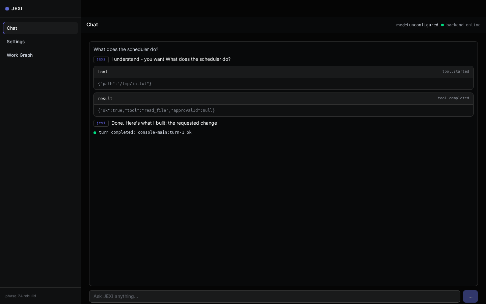
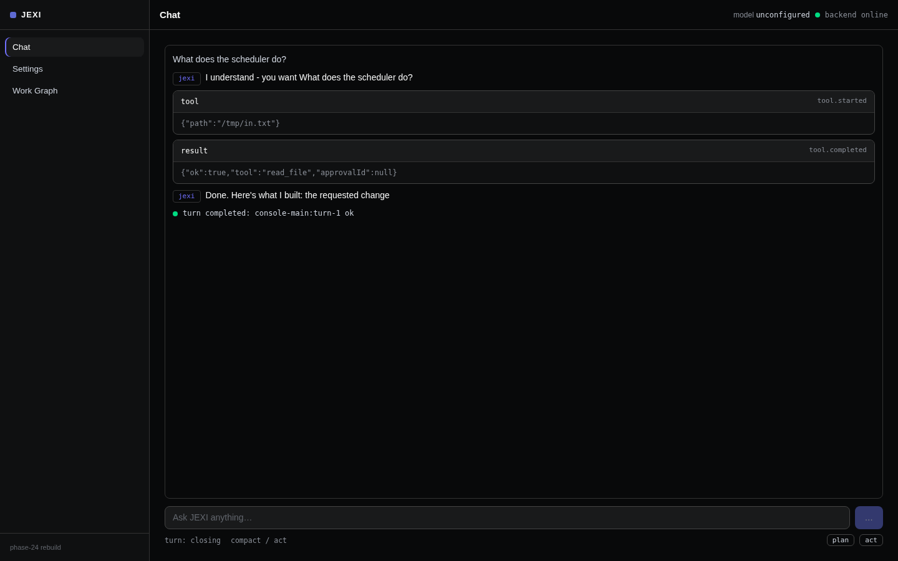
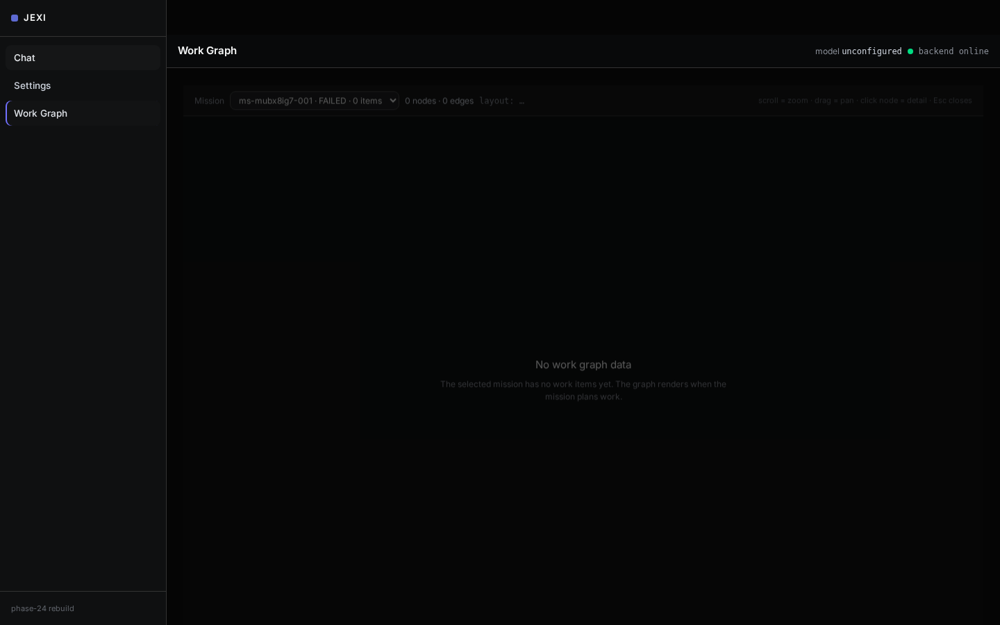
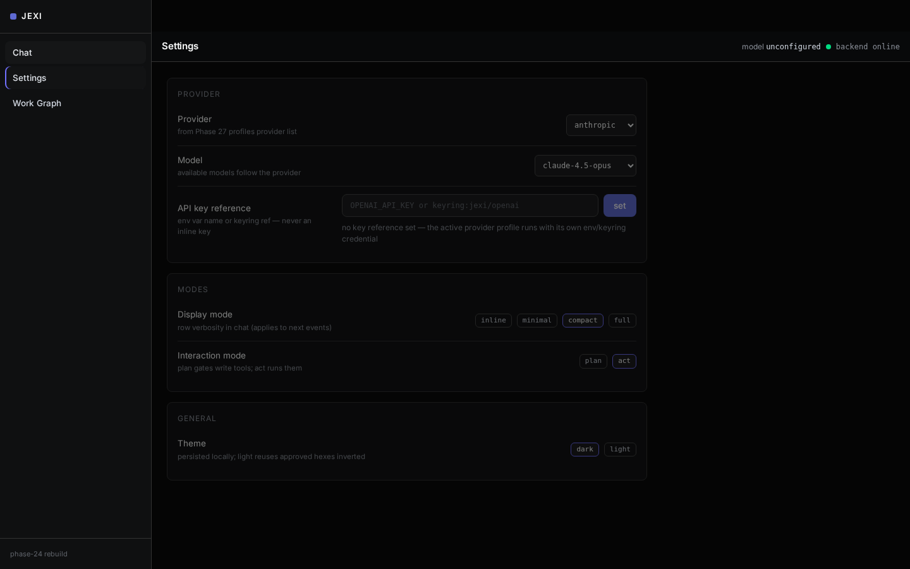
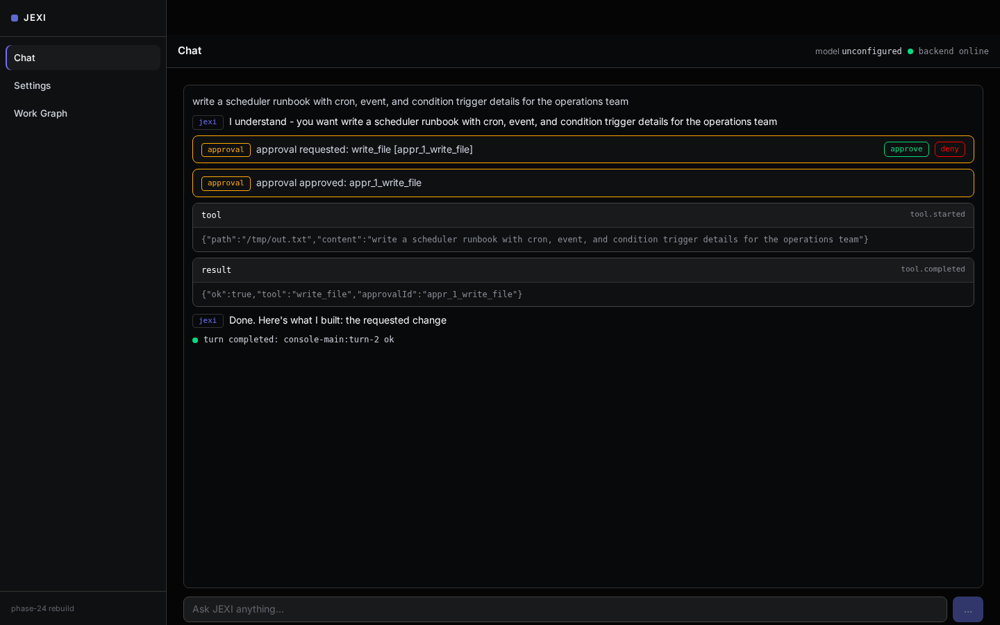
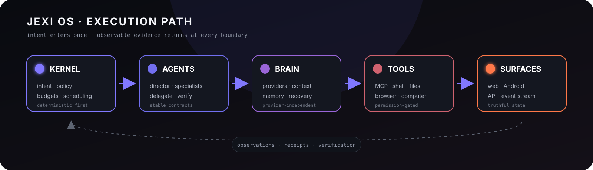

# JEXI OS

**Your own agentic OS: it plans, acts, remembers, and proves.**

<p>
  <a href="https://github.com/lewiseinstein15-Tech/jexi-os-/actions/workflows/ci.yml"></a>
  <a href="LICENSE"></a>
  <a href="package.json"></a>
  <a href="https://github.com/lewiseinstein15-Tech/jexi-os-/stargazers"></a>
  <a href="https://github.com/lewiseinstein15-Tech/jexi-os-/issues"></a>
</p>



*A real turn, captured live: the question in the composer, JEXI's narration, the tool call and its result, and the closing turn-end row. No provider was configured for this capture, so the answer comes from the deterministic in-process agent; configure one provider and the same surface streams a model-backed answer.*

## What is JEXI?

JEXI is an agentic operating system: a runtime that runs a workforce of agents against your work, remembers what it learns, and can see and operate a screen. It is local-first and runs on Node.js 22+ as a web console in the browser, as a terminal-driven brain, or on a phone through the Android APK. It plugs into any OpenAI-compatible provider, local models, and MCP servers, and exposes a permission-gated tool catalog that covers files, terminal, git, GitHub, web, browser navigation, memory, testing, data, LSP, and delegation. What sets it apart is persistent memory with provenance behind a frozen five-verb protocol, vision-grounded computer control, a 30-event lifecycle hook system, and a receipt for every tool call so that what the agent claims can be checked against what it did.

## Capabilities

Every number below is read from the source tree in this repository; the derivation commands are listed in [`docs/assets/screenshots/evidence/capability-counts.txt`](docs/assets/screenshots/evidence/capability-counts.txt).

| Capability | Count | Where it lives |
|---|---|---|
| Agents in the workforce registry | **400** | `workforce/agents` (`list().length`) |
| Divisions | **18** | `workforce/divisions.json` |
| Built-in tools (12 domains) | **39** | `server/src/tools/domains` |
| Skills (`SKILL.md` catalog) | **1,164** | `skills/library` |
| MCP servers registered / enabled by default | **56 / 30** | `server/mcp/registry.json` |
| Tools exposed by the MCP directory | **542** | `server/mcp/tool-directory.json` |
| Web search engines (keyed, keyless, and mesh) | **20** | `server/src/services/WebSearch.js` |
| Computer-use actions | **16** | `server/src/services/ComputerUseTraining.js` |
| Lifecycle hook events | **30** | `harness/parity/hooks/catalog.js` |
| Memory verbs (frozen protocol v1.0) | **5** | `brain/protocol/verbs.js` |
| Dream-cycle phases | **13** | `brain/cycle/phases` |
| Console surfaces | **3** | `ui/web/console/shell/routes.js` |
| Research output formats | **12** | `surfsense/output/formats.js` |
| Source connectors | **16** | `surfsense/connectors` |
| Retrieval benchmark metrics | **P@5 / R@5** | `brain/evals/brainbench.js` |

## Screenshots

<table>
  <tr>
    <td width="50%"><br>Tool receipts: the real <code>tool.started</code> and <code>tool.completed</code> cards for a <code>read_file</code> call, rendered in the transcript.</td>
    <td width="50%"><br>Work Graph: the mission graph route with its honest live state; this capture has zero nodes because no mission was running.</td>
  </tr>
  <tr>
    <td colspan="2"><br>Settings: provider, model, and key reference. The key itself never goes in the form; only an environment-variable name or keyring reference.</td>
  </tr>
</table>

## A real example flow

You type a request that writes something: *"write a scheduler runbook with cron, event, and condition trigger details for the operations team."* JEXI opens a turn and narrates what it understood. Because the request needs `write_file`, which is a destructive tool, the runtime pauses the turn and renders an approval row; nothing is written until you click **approve**. On approval the tool starts, its `tool.started` and `tool.completed` receipts appear as cards carrying the exact arguments and result, JEXI narrates the outcome, and the turn closes with a `turn completed … ok` row. Every event in that sequence is the runtime's own event stream rendered live; the capture below is that moment.



## Quick Start

Requires **Node.js 22 or newer**.

```bash
git clone https://github.com/lewiseinstein15-Tech/jexi-os-.git
cd jexi-os-
npm ci
npm --prefix server ci
npm run dev:full
```

Then open <http://localhost:3000>. `dev:full` starts the brain on `:3002` and the console on `:3000`.

**Provider.** Configure ONE provider in **Settings → Model**: pick the provider and model, then set a `keyRef` (an environment-variable name such as `OPENAI_API_KEY`, or `keyring:<ref>`). Keys are never entered inline. Without a configured provider the console still works: the deterministic in-process agent answers with narration, tool receipts, and a turn-end row, not a model-generated answer. Configure a provider to unlock real LLM answers.

Verification note: `npm ci`, `npm --prefix server ci`, and `npm run dev:full` were verified on the capture host against the checked-out tree; the `git clone` step is NOT VERIFIED on that host because it has no Git transport to this repository.

## Architecture



Surfaces (web console, Android, API) send commands to the executive kernel and receive its event stream back. The kernel owns intent, policy, budgets, scheduling, and recovery, and staffs work to agents through stable contracts. Agents reason through the brain (providers, context, memory, verification) and act through permission-gated tools that reach the computer, the browser, the shell, files, and MCP servers. Everything a tool does returns as evidence and receipts that flow back into the kernel and the transcript. The deep dive is in [docs/REBUILD-MAP.md](docs/REBUILD-MAP.md).

## What's inside

- **Agent runtime** (`workforce/`, `server/src/services`): a 400-agent, 18-division registry with capability inference, trust levels, subagent spawning, and per-turn narration.
- **Brain** (`brain/`): hybrid search, hot memory, knowledge graph, the five-verb memory protocol, a 13-phase dream cycle, and the BrainBench retrieval benchmark.
- **Computer agent** (`server/src/services/ComputerUseAgent.js`, `runtimes/browser`): vision-grounded browser and desktop control with a 16-action vocabulary and screenshot read-back.
- **Tools and MCP** (`server/src/tools`, `server/mcp`): 39 built-in tools across 12 domains plus 53 registered MCP servers, all behind approval gates and receipts.
- **Swarm and instincts** (`swarm/`, `instincts/`): parallel worker orchestration and learned behavioural priors that shape how agents pick tools.
- **Prompt architecture** (`prompt/`): a layered constitution, output-format contracts, and per-agent identity.
- **Research engine** (`surfsense/`): 16 source connectors, 20 web search engines, and 12 output formats.
- **Harness** (`harness/`, `hooks/`): the 30-event lifecycle hook catalog, rules, and parity probes that keep the runtime honest.

## Docs

The complete, linked index of everything under `docs/` is [docs/README-INDEX.md](docs/README-INDEX.md).

## License

Code is licensed **MIT** — see [LICENSE](LICENSE). Data obtained from external
providers is **NOT** covered by MIT: every external data source carries its own
license and terms, documented per source in [DATA_SOURCES.md](DATA_SOURCES.md).
Dependency licenses are aggregated in [THIRD_PARTY_NOTICES.md](THIRD_PARTY_NOTICES.md).

## Contributing

Work on a branch per scope and stop after each one for review. Keep every change inside its declared zone, attach raw probe evidence (commands and their output, real screenshots, never mockups), and report anything you could not exercise as not verified rather than claiming it. Never add credentials or new dependencies without explicit approval.

---

*Built by Lewis & the JEXI agent · MIT · 100% free-tier infrastructure, no credit card, ever.*
