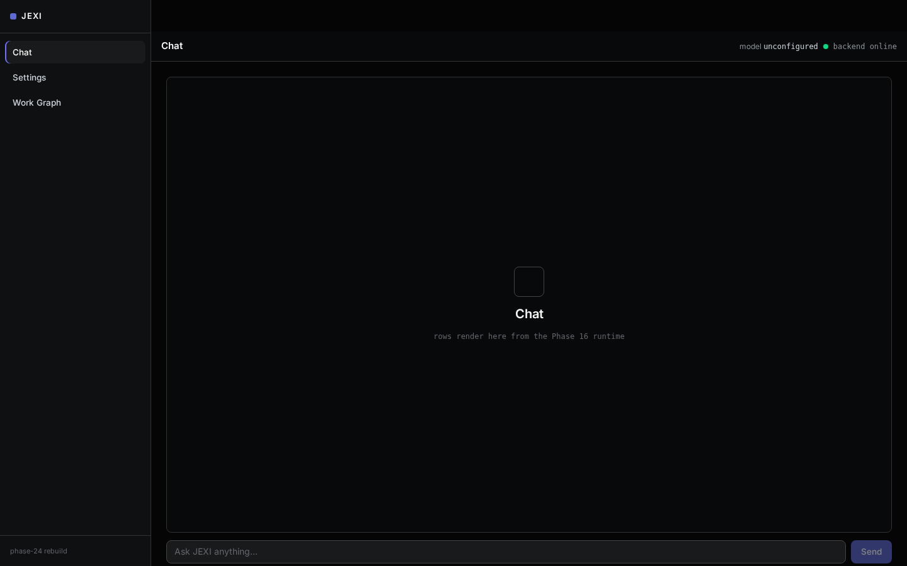
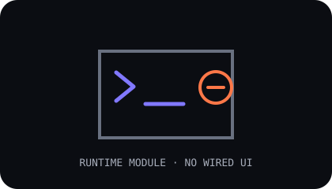
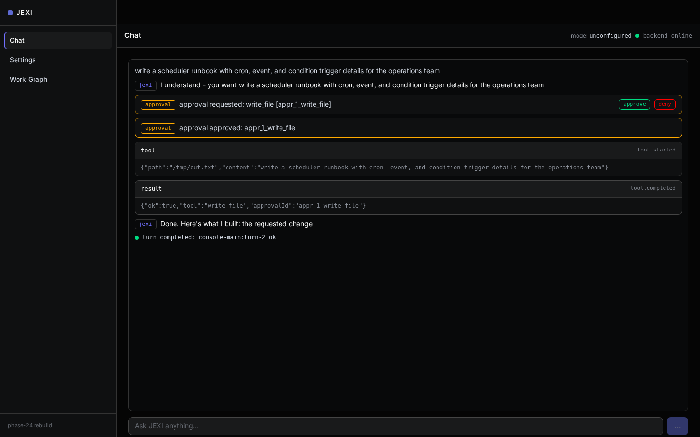
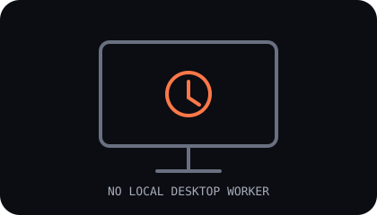
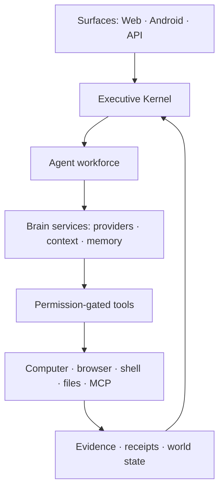

# JEXI OS

**An agentic operating system that plans, acts, remembers, and proves.**

<p>
  <a href="https://github.com/lewiseinstein15-Tech/jexi-os-/actions/workflows/ci.yml"></a>
  <a href="LICENSE"></a>
  <a href="package.json"></a>
  <a href="#roadmap"></a>
  <a href="#quality"></a>
</p>



## What is JEXI?

JEXI is an agentic operating system that turns an objective into observable, resumable work. Its brain combines deterministic routing, provider-backed reasoning, memory, scheduling, recovery, and evidence. Specialized agents plan, delegate, execute, critique, and verify through stable contracts instead of pretending that one model did everything. Permission-gated computer control connects the system to browsers, files, shells, devices, and external tools while reporting unavailable workers honestly.


## Feature matrix

Screens are captured from the default local console (the Phase 24 three-surface shell: Chat / Settings / Work Graph) with the brain running; a labeled icon is used where a capability has no wired UI in that shell. Nothing below is a product mockup.

| Capability | What exists today | Surface evidence |
|---|---|---|
| **Executive kernel** | Deterministic-first intent, policy, budget, scheduling, recovery, and verification seams. |  |
| **Brain and providers** | Provider/model selection, key-reference handling, health, context, memory, and provider-independent routing. A hosted provider requires a valid key. |  |
| **Agent workforce** | Stable employee contracts, capability staffing, runtime bench controls, and per-agent execution history. No agent-roster surface is wired in the default shell yet; the fleet is served by the brain API. |  |
| **Chat and tool receipts** | The Phase 16 runtime routes narration, tool calls, results, approvals, and terminal turn state into the default console. Without a configured provider the deterministic in-process agent answers with narration, tool receipts, and a turn-end row. |  |
| **Modes and approvals** | Inline through full display modes plus plan/act interaction controls; destructive work is approval-gated. |  |
| **Persistent work graph** | Mission graph route with deterministic layout, node details, zoom/pan, and an explicit empty state. The current capture reports zero nodes rather than seeding fake work. |  |
| **Multi-agent execution** | Plan, roster, pipeline events, and tool routing run in the brain and the Phase 16 runtime. Split/nested multi-agent projections are not wired into the default shell. |  |
| **Computer control** | Browser Router, desktop, Android, shell, file, and MCP seams are permission-gated. No local desktop worker was available during this capture. |  |
| **Workspace checkpoints** | Checkpoint, diff, and rollback controls exist in the brain and the Phase 16 checkpoint module. No checkpoint surface is wired into the default shell. |  |

## Gallery

<table>
  <tr>
    <td width="50%"><br><strong>Default console</strong> — Chat / Settings / Work Graph, live backend status, empty composer.</td>
    <td width="50%"><br><strong>Turn just sent</strong> — a real question sent through the composer; the composer is still in its busy state. The deterministic in-process agent completes a turn in a few milliseconds, so rows arrive progressively but faster than a screenshot.</td>
  </tr>
  <tr>
    <td><br><strong>Completed turn</strong> — user message, narration rows, tool receipts, and the turn-end row. Deterministic in-process agent; no provider configured.</td>
    <td><br><strong>Tool receipts</strong> — real <code>tool.started</code> / <code>tool.completed</code> cards from the Phase 16 runtime.</td>
  </tr>
  <tr>
    <td><br><strong>Provider settings</strong> — provider, model, and key reference; no inline secret.</td>
    <td><br><strong>Work graph</strong> — honest live state: the selected mission currently has no work items.</td>
  </tr>
  <tr>
    <td colspan="2"><br><strong>Full / act</strong> — mode switch plus approval and started/completed tool receipts.</td>
  </tr>
</table>

## Quick Start

> **Requirement:** Node.js **22 or newer**. This repository uses APIs that degrade under Node 20.

1. **Clone the repository.**

   ```bash
   git clone https://github.com/lewiseinstein15-Tech/jexi-os-.git
   cd jexi-os-
   ```

2. **Install the locked root and brain dependencies.**

   ```bash
   npm ci
   npm --prefix server ci
   ```

3. **Configure one provider through Settings → Model.** Export a valid hosted-provider key first, for example `OPENAI_API_KEY`, then choose its provider/model and enter the environment-variable name or approved keyring reference after the console opens. The key-reference field must not contain the secret itself; at least one configured provider with a valid key is required for provider-backed execution.

4. **Run the brain and web console.**

   ```bash
   # terminal 1 — brain on :3002
   npm --prefix server start

   # terminal 2 — Vite on :3000
   npm run dev
   ```

   Open <http://localhost:3000>. `npm run dev:full` is the one-terminal equivalent. The default boot is the three-surface console (Chat / Settings / Work Graph). The previous executive console is kept in the codebase and is reachable only at <http://localhost:3000/#classic>.

> Capture-host clone step: **NOT VERIFIED** - Git transport to this repository was unavailable on the capture host (standing auth incident); `npm ci`, `npm --prefix server ci`, and `npm run dev:full` were verified against the checked-out tree.
>
> Capture-host provider execution: **NOT VERIFIED - requires provider**. Without a configured provider the chat answers come from the deterministic in-process default agent (narration + tool receipts + turn-end row), not from an LLM. Configure ONE provider to unlock real LLM answers. Health, the deterministic chat runtime, settings, work graph, and console rendering were verified without claiming a configured model.

## Roadmap

| Stage | Status | Outcome |
|---|---|---|
| **Phases 0–27** | **Merged** | Core OS, brain, workforce, tools, memory, autonomy, Phase 16 chat runtime, Phase 24 console rebuild, and provider profiles. |
| **Phase 28** | **In flight** | Memory, retrieval, knowledge-graph, reranking, and evaluation work is backend-only; no UI is claimed. |
| **Phase 29** | **In flight** | Backend-only system work; no visible surface is fabricated for it. |
| **Phase 30** | **In flight** | Harness parity, agent patterns, documentation, and the final regression gate. |
| **Benchmark** | **Next** | Run the frozen benchmark and publish comparable evidence. |
| **Go Live** | **Next** | Complete release checks, deployment, monitoring, and operator handoff. |

## Architecture

The Executive Kernel owns intent, policy, budgets, scheduling, and recovery. It staffs agents through stable contracts; agents use brain services for reasoning, context, memory, and verification; permission-gated tools touch the outside world; every surface consumes the same observable events. The visual chain above is the short form, while [REBUILD-MAP.md](docs/REBUILD-MAP.md) maps the broader rebuild to its implementation and proof.



```text
SURFACES
   ↓ commands / ↑ events
KERNEL → AGENTS → BRAIN → TOOLS → COMPUTER + EXTERNAL SYSTEMS
   ↑                                            │
   └──────── evidence, receipts, verification ──┘
```

## Documentation

Start with the complete, linked [documentation index](docs/README-INDEX.md). It inventories every file under `docs/`, including architecture, audits, implementation reports, research, screenshots, and Scope H evidence.

## Quality

- The repository contains **4,000+ automated checks** across the brain, agents, tools, memory, autonomy, security, browser routing, and UI contracts.
- Run the full backend suite with `npm test`; run the production frontend build with `npm run build`.
- Screenshots in this README are generated by [`scripts/phase30-readme-shots.mjs`](scripts/phase30-readme-shots.mjs) against `localhost`, not by a design mock.
- Provider-dependent behavior must be reported as not verified when no valid provider is configured.

## Contributing

Use a **branch per scope**, keep each change inside its declared zone, and attach raw verification evidence. Prefer small, reviewable commits; do not combine unrelated scopes or claim a surface that was not exercised.

## License

Code is licensed **MIT** — see [LICENSE](LICENSE). Data obtained from external
providers is **NOT** covered by MIT: every external data source carries its own
license and terms, documented per source in [DATA_SOURCES.md](DATA_SOURCES.md).
Dependency licenses are aggregated in [THIRD_PARTY_NOTICES.md](THIRD_PARTY_NOTICES.md).

---

*Built by Lewis & the JEXI agent · MIT · 100% free-tier infrastructure, no credit card, ever.*
